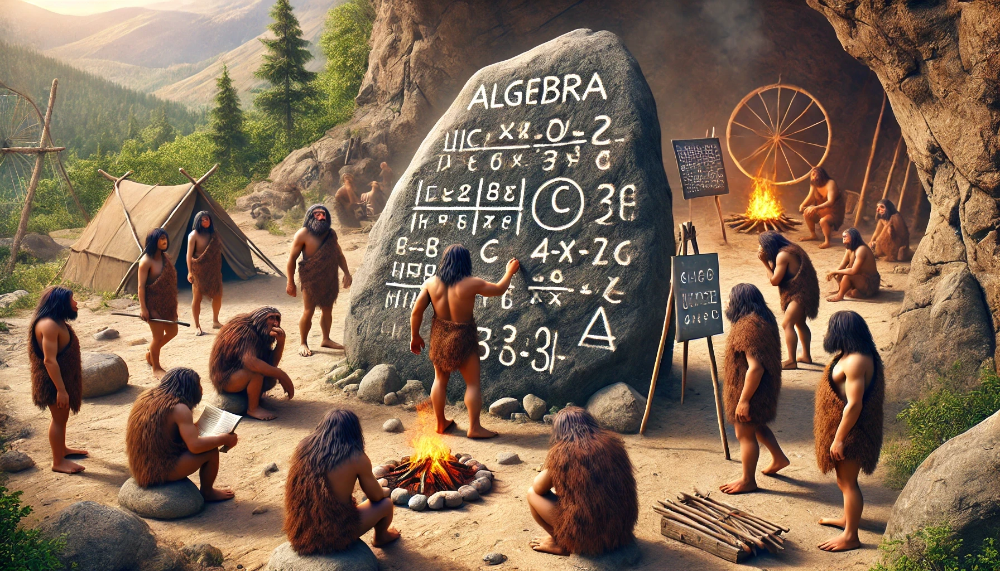
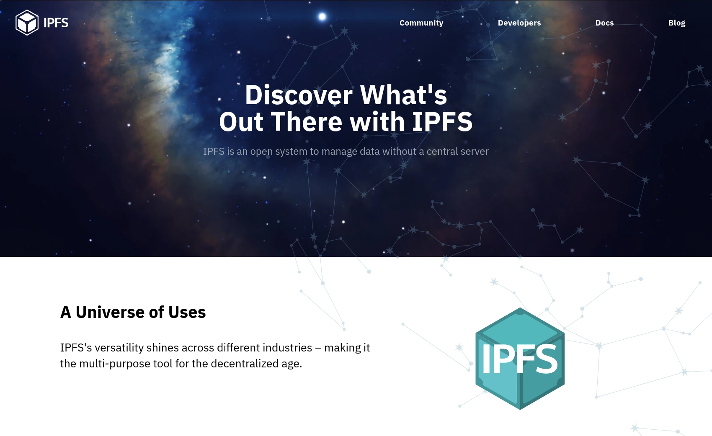
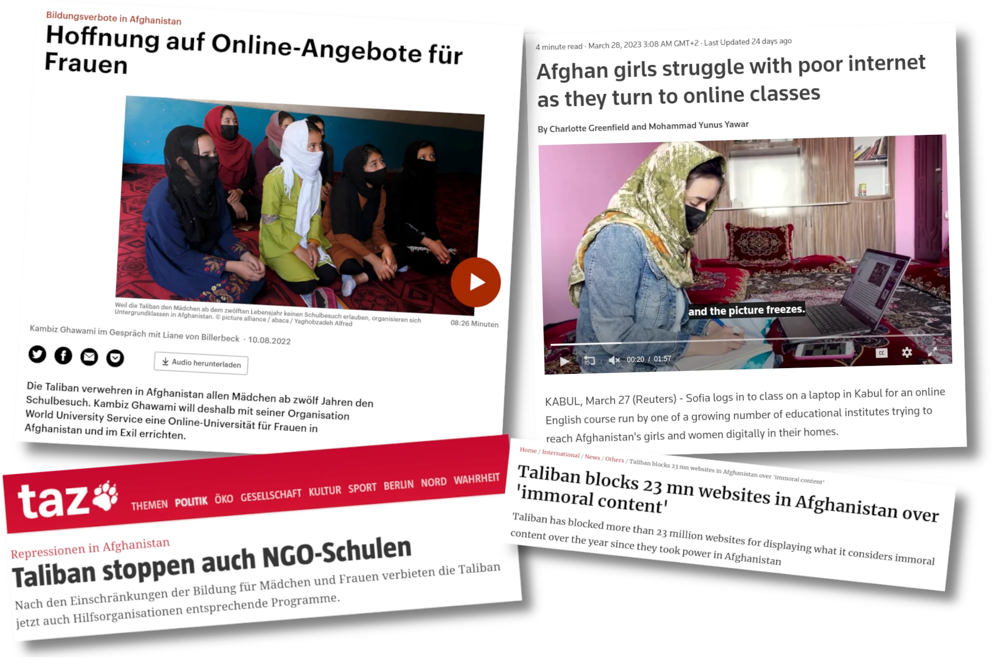
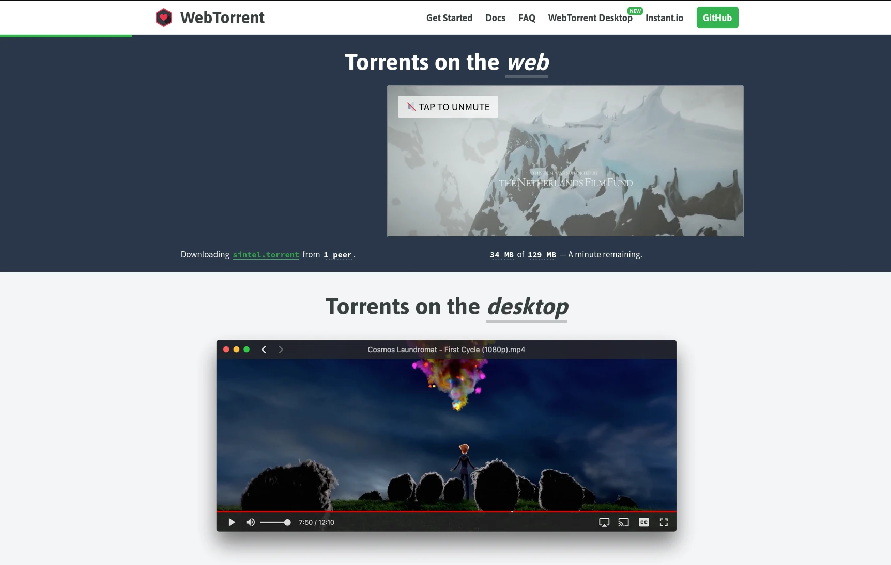

<!--
author:   André Dietrich; Sebastian Zug

email:    LiaScript@web.de

version:  0.0.1

language: en

narrator: UK English Male

comment:  In this presentation, we explore innovative approaches to digital education and content sharing using open-source technologies. We discuss the challenges of creating interactive and collaborative Open Educational Resources (OER) and demonstrate how tools like LiaScript and WebRTC can enhance educational experiences. We delve into the use of Conflict-Free Replicated Data Types (CRDTs) for decentralized synchronization and highlight the potential of IPFS and OnionShare for secure content distribution. Furthermore, we introduce edrys and its browser-based counterpart, edrys-Lite, showcasing their modular frameworks for remote labs and classrooms. These tools enable seamless hardware sharing and collaborative learning through decentralized, real-time interactions. Join us to discover how these technologies can revolutionize your educational projects and make them more accessible, interactive, and secure.

logo:     img/logo.webp

link: https://cdnjs.cloudflare.com/ajax/libs/animate.css/4.1.1/animate.min.css

script: https://cdn.jsdelivr.net/npm/algebrite@1.4.0/dist/algebrite.bundle-for-browser.min.js

@calc
<script>
  Algebrite.run(`@input`)
</script>
@end

@style
.flex-container {
  display: flex;
  flex-wrap: wrap;
  align-items: stretch;
}

.flex-child{
  flex: 1;
  margin-right: 20px;
}

@media (max-width: 600px) {
  .flex-child {
    flex: 100%;
    margin-right: 0;
  }
}

@keyframes burn {
  0% {
    text-shadow: 0 0 5px #ff0, 0 0 10px #ff0, 0 0 15px #f00, 0 0 20px #f00,
      0 0 25px #f00, 0 0 30px #f00, 0 0 35px #f00;
  }
  50% {
    text-shadow: 0 0 10px #ff0, 0 0 15px #ff0, 0 0 20px #ff0, 0 0 25px #f00,
      0 0 30px #f00, 0 0 35px #f00, 0 0 40px #f00;
  }
  100% {
    text-shadow: 0 0 5px #ff0, 0 0 10px #ff0, 0 0 15px #f00, 0 0 20px #f00,
      0 0 25px #f00, 0 0 30px #f00, 0 0 35px #f00;
  }
}

.burning-text {
  font-weight: bold;
  color: #fff;
  animation: burn 1.5s infinite alternate;
}
@end


-->

__Open in:__

* LiaScript: https://liascript.github.io/course/?https://raw.githubusercontent.com/LiaPlayground/Transforming-Education/main/README.md
* LiveEditor: https://liascript.github.io/LiveEditor/?/show/file/https://raw.githubusercontent.com/LiaPlayground/Transforming-Education/main/README.md

# Transforming Education

--------------------------------------------------
A Journey from Interactive Markdown to Remote-Labs
==================================================

__Dr. André Dietrich / TU Bergakademie Freiberg__

     {{0-1}}
**************************************************

__eMail:__ [LiaScript\@web.de](mailto:LiaScript@web.de)

__Twitter/X:__ [\@LiaScript](https://x.com/LiaScript)

__LinkedIn:__ https://www.linkedin.com/in/andr%C3%A9-dietrich-73949415/

__Presentation:__ https://github.com/LiaPlayground/Transforming-Education

--------------------------------------------------

<div class="flex-container">

<!-- class="flex-child" -->
[qr-code](https://github.com/LiaPlayground/Transforming-Education "GitHub-Repository with Presentation")

<!-- class="flex-child" -->
[qr-code](https://liascript.github.io/course/?https://raw.githubusercontent.com/LiaPlayground/Transforming-Education/main/README.md "Interactive LiaScript version")

</div>

**************************************************

      {{1}}


    --{{1}}--
Hello, my name is André Dietrich, and I am a researcher at the TU Bergakademie Freiberg in Germany. Today, I would like to discuss some of the significant challenges in education and digitalization, and how we have approached these issues from an open-source perspective.
Additionally, I aim to build a bridge between the education sector and web development by sharing the technologies we have discovered during our journey. These technologies are freely available and can be integrated into your projects.
Whether you are looking to create your own interactive courses and classrooms, transform your Markdown documentation into interactive and collaborative content, share hardware remotely, or pursue something entirely different, I hope you find inspiration in our work.

## Open-Educational-Resources

    --{{0}}--
Open Educational Resources (OER), as defined by UNESCO, are teaching, learning, and research materials in any medium — digital or otherwise — that reside in the public domain or have been released under an open license. This open licensing allows no-cost access, use, adaptation, and redistribution by others with no or limited restrictions. OER includes full courses, course materials, modules, textbooks, streaming videos, tests, software, and any other tools, materials, or techniques used to support access to knowledge.


    --{{1}}--
The term OER was coined in 2002 at a UNESCO forum, and since then, the movement has gained such momentum, that we still need to explain it 22 years after.

### The biggest Problems of OER

    --{{0}}--
As you might have noticed, OER closely mirrors the open-source concept but with some significant differences:

      {{1}}
<section>

#### Lack of technical skills

    --{{1}}--
You can be an expert of Arts, Medicine, or History, but you might not be a developer.
This is a significant issue, as most Open Educational Resources are created by teachers, professors, or researchers who may not be familiar with the technical aspects of digital content creation. If we are honest, the medium has evolved — from stone carvings and clay tablets to paper and writing, books and printing, and now computers and __PDFs__ — but the representation has remained largely the same. Despite the vast capabilities of computers, such as enabling speech, immersive 3D experiences, and interactive content, many OERs still do not fully leverage these possibilities.



</section>  

      {{2}}
<section>

#### Separation by Tools, Platforms, and Formats

    --{{2}}--
There are numerous platforms, tools, and formats available for creating digital content. However, each platform creates its own isolated ecosystem with unique capabilities and limitations. Most of these solutions do not support multiple authors or versioning, which hinders collaborative content creation. Utilizing version control systems and platforms like GitHub or GitLab, which offer open review systems, discussion forums, wikis, and more, could address the majority of challenges we face in the creation of OER.


</section>

      {{3}}
<section>

#### OER has _No Language & No Collaboration_

    --{{3}}--
This brings us to the elephant in the room. In the open-source world, communities typically gather around programming languages, libraries, or frameworks. However, in the OER world, there is no equivalent creators mostly work on their own.
Furthermore, most OER authoring tools offer a word processor-like environment, requiring users to memorize various point-and-click sequences. If there is no dedicated button, then a feature becomes inaccessible. This limitation significantly restricts the creativity and flexibility of content creators.


</section>

## Markdown / LiaScript

Using Markdown for Interactive Content Creation?
------------------------------------------------

    --{{0}}--
By using a markup language like Markdown, we can instantly use versioning systems with all of their benefits for creating educational content, it is easy to learn, easy to write, and <span class="burning-text">static as HELL</span> and not extendable.

     {{1-2}}
<section>

    --{{1}}--
But, what hinders us to reinterpret it?

?[Giorgio Moroder](https://music.youtube.com/watch?v=zhl-Cs1-sG4&si=fwB6LT2I0rQ0_CGE&start=300&end=312&autoplay=1)<!-- style="border-radius: 10px; border: none" -->

> ... Once you free your mind about a concept of Harmony and of music being "correct" You can do whatever you want ...
>
> -- Giorgio Moroder (The inventor of Disco-Music)

</section>

    --{{2}}--
So what hinders us to interpret a table as static representation of data that seeks for an ideal visualization.

      {{2}}
| Animal          | weight in kg | Lifespan years | Mitogen |
| --------------- | ------------:| --------------:| -------:|
| Mouse           |        0.028 |             02 |      95 |
| Flying squirrel |        0.085 |             15 |      50 |
| Brown bat       |        0.020 |             30 |      10 |
| Sheep           |           90 |             12 |      95 |
| Human           |           68 |             70 |      10 |


    --{{3}}--
Another tabular structure might generate another visualization, which can be finetuned by the creator.

      {{3}}
<!--
data-type="heatmap"
data-title="Seattle mean temperature in Fahrenheit"
data-show
-->
| Seattle |  Jan |  Feb |  Mar |  Apr |  May |  Jun |  Jul |   Aug |  Sep |  Oct |  Nov |  Dec |
| -------:| ----:| ----:| ----:| ----:| ----:| ----:| ----:| -----:| ----:| ----:| ----:| ----:|
|       0 | 40.7 | 41.5 | 43.6 | 46.6 | 51.4 | 56.0 | 60.5 |  61.2 | 57.0 | 50.1 | 44.1 | 39.6 |
|       2 | 40.2 | 40.7 | 42.7 | 45.3 | 50.0 | 54.4 | 58.5 |  59.2 | 55.4 | 49.2 | 43.5 | 39.3 |
|       4 | 39.7 | 40.0 | 41.9 | 44.4 | 48.9 | 53.2 | 57.0 |  57.7 | 54.2 | 48.6 | 43.1 | 38.9 |
|       6 | 39.6 | 39.5 | 41.3 | 44.2 | 49.5 | 54.2 | 57.8 |  57.4 | 53.6 | 48.2 | 42.8 | 38.7 |
|       8 | 39.6 | 39.9 | 42.9 | 47.1 | 52.7 | 57.3 | 61.3 |  61.1 | 56.7 | 49.5 | 43.1 | 38.7 |
|      10 | 41.3 | 42.7 | 46.4 | 50.7 | 56.4 | 60.9 | 65.2 |  65.4 | 60.9 | 52.8 | 45.5 | 40.4 |
|      12 | 43.8 | 46.0 | 49.5 | 53.8 | 59.6 | 64.3 | 69.4 |  69.8 | 65.1 | 56.0 | 47.8 | 42.6 |
|      14 | 45.1 | 47.7 | 51.3 | 55.9 | 61.9 | 66.9 | 72.6 |  73.2 | 67.7 | 57.8 | 48.8 | 43.6 |
|      16 | 44.5 | 47.5 | 51.4 | 55.9 | 62.3 | 67.5 | 73.9 |  74.3 | 68.2 | 57.4 | 47.8 | 42.6 |
|      18 | 42.6 | 44.7 | 48.7 | 53.8 | 60.3 | 65.9 | 72.3 |  72.2 | 64.6 | 53.9 | 46.0 | 41.2 |
|      20 | 42.0 | 43.3 | 46.4 | 50.2 | 56.0 | 61.4 | 66.9 |  66.6 | 60.7 | 52.3 | 45.2 | 40.7 |
|      22 | 41.4 | 42.5 | 45.0 | 48.3 | 53.5 | 58.2 | 63.2 |  63.5 | 58.7 | 51.1 | 44.5 | 40.1 |

    --{{4}}--
LiaScript allow to embed multimedia-content, like audio, video, or anything else that is embeddable in a browser, only marking the links

     {{5-6}}
<section>

#### Audio ?

    --{{5}}--
In contrast to an exclamatory mark, the question mark, which looks like an ear, is used for audio content.

`?[alt-text](url)`

?[Barbaras Rhabarberbar](https://open.spotify.com/track/7ki0Q2nYTBhVxZvqLLDp5W)

</section>

     {{6-7}}
<section>

#### Video !?
  
   --{{6}}--
A movie is simply audio with images and thus uses both symbols.

`!?[alt-text](url)`

!?[#OER erklärt an der Rhababerbar ](https://www.youtube.com/watch?v=1AhegtIAqJ8)

</section>

      {{7}}
<section>

#### Anything ??

`??[alt-text](url)`

    --{{7}}--
If you are unsure about the content, you can use a double question mark (??). This will utilize oEmbed to embed the content.

??[Esther’s scroll in a cover](https://sketchfab.com/3d-models/esthers-scroll-in-a-cover-21a13eba33cb4343bab56f0c0f982876 "Historical Museum of the City of Kraków")

    --{{8}}--
And if this does not work, embed it as an iframe:

      {{8}}
??[Falstad circuit simulation](https://www.falstad.com/circuit/circuitjs.html?ctz=CQAgjCAMB0l3BWcMBMcUHYMGZIA4UA2ATmIxAXKQUgoFMBaMMAKADdwwUQUFDPuxfrWwgALLSS1p0BCwDmAnnyW4xUKCwDuIbAm5c8u-eGLdI2nvnAojaI2AzDLzbr373lznZ9-X3mgCGVg5mxgZhXOBITEhg8PBQsJAYpGgpaZBgpGLqtPFwLADGSkIhIGUyCZDcDCiyxAiZGXhN1jBwrABO5YbhNkaS8JaeZZ59FgDy-dncYmD8sxoWAPYa2ObikMQOVVxSPOssa-G6mxI7yEkJZIR8vBqsQA "Operational Amplifier OVP - Differentiator (Inverting)")

</section>

    --{{9}}--
You might have noticed that this document is being used like a PowerPoint presentation. However, our intention was to utilize LiaScript in various contexts. With LiaScript, you can create presentations, enable self-study through browser-based text-to-speech output, or read the content as simple yet interactive textbook, without animations.

### More Education

    --{{0}}--
In most educational context there is also something required like testing of the knowledge, which can be done with multiple types of quizzes and surveys.
In LiaScript this was originally done to add the support of didactic team-members, that wanted to test student performance.

    --{{1}}--
Based on the github flavoured markdown notation for tasks, we added the double brackets to create multiple choice quizzes:

      {{1}}
- [[X]] Is this realy rendered as a quiz
- [[ ]] There are multiple easier ways of defining quizzes in Moodle
- [[X]] HTML is not a programming language

    --{{2}}--
How would you define a single choice quiz?

      {{2}}
- [( )] Programm it by myself, using HTML, CSS, and JavaScript
- [(X)] By using parenthesis to represent the radio buttons
- [( )] By using an external authoring system with lots of configurations

    --{{3}}--
By using this pattern everywhere, we can recreate various different types of quizzes, and fine tune them.

     {{3}}
Wladimir [[ Putin ]] is the richest (still living) dictator
with an estimated fortune of over
__4,500,000,000 [[ (US Dollar 💵) | Euro 💶 | _Rubel 💸_ | Pound 💷 ]]__!
****************************************************

> {{Russian Female |>}}
> 😱 боже мой, боже мой, боже мой ..., for this money an ordinary soldier has to fight in combat for **138.889 years**.
>
> Source: [The Guardian](https://www.theguardian.com/world/2022/jun/20/russian-emails-vladimir-putin-llcinvest)

<!-- class="animate__animated animate__delay-5s animate__hinge" -->

****************************************************

### Interactive Coding

    --{{0}}--
Imagine you, as a developer, creating your README. It's great to add quizzes to check if your users have understood your library or API. But wouldn't it be even better to include code examples that can be executed directly in the browser?

```javascript
var s = "JavaScript syntax highlighting";
alert(s);
```

    --{{1}}--
The current example demonstrates a JavaScript snippet. Our question was, why can't this code be executed directly in the browser? To address this, we added a script to enable direct execution.

      {{1}}
```javascript
var s = "JavaScript syntax highlighting";
alert(s);
```
<script> @input </script>

    --{{1}}--
In the simplest scenario, it uses the `@input` placeholder to replace it with the current code.

    --{{2}}--
Such scripts can grow large and become difficult to maintain, and they are not rendered nicely on GitHub. What is missing is a method to embed external resources and create reusable code snippets. Simply import a script and define custom substitutions to process the input.

      {{2}}
https://www.jsdelivr.com/package/npm/algebrite

      {{2}}
``` text
1000!
```
@calc

    --{{3}}--
Just like in other programming languages, it would be beneficial to have modules or libraries that can be imported and used in your code. This is where you, as a developer, come in. You can not only make your documentation interactive but also enable your README to be imported into other courses and reused.
Here is a list of various templates that can be utilized in your project, supporting a wide range of functionalities including different programming languages, 3D visualization, simulations, math, style-checking in text, and even music theory and composition:

      {{3}}
https://github.com/topics/liascript-template

    --{{4}}--
By the way, if you are interested in a better text2speech API for different browsers, try out EasySpeech developed by Jan Küster:

      {{4}}
https://github.com/leaonline/easy-speech

      {{4}}
``` javascript
import('https://cdn.jsdelivr.net/npm/easy-speech/+esm')
.then(async (module) => {
  const EasySpeech = module.default;
  
  console.debug('EasySpeech import succeeded....')
  console.log(JSON.stringify(EasySpeech.detect(), null, 2))
  await EasySpeech.init({ maxTimeout: 5000, interval: 250 })
  console.debug('starting speech recognition...')
  console.log(JSON.stringify(EasySpeech.defaults(), null, 2))

  window.EasySpeech = EasySpeech
  const voices = EasySpeech.voices()
  let voice = 0

  window.changeVoice = (v) => {
    voice = v
    console.warn("changed voice to", voices[v].voiceURI)
  }

  let voiceMenu = ""
  for (let i=0; i < voices.length; i++) {
    voiceMenu += `<option value="${i}">${voices[i].voiceURI}</option>`
  }
  console.html("<select onchange='window.changeVoice(this.value)' style='background: black; border: 1px white solid;'>"
  + voiceMenu + "</select>")
  

  const speak = (text) => EasySpeech.speak({
    text,
    voice: voices[voice],
    pitch: 1,
    rate: 1,
    volume: 1,
  })

  await speak("Hello, I am LiaScript, your interactive Markdown interpreter.")
  await speak("Please type in some words!")
  // connect chat with LiaScript events
  send.handle("input", speak)
})
.catch((error) => {
  console.error('Module import failed:', error);
});
```
<script>
@input

"LIA: terminal"
</script>

### Redefining `<script>`

    --{{0}}--
Doesn't it feel wrong to have a script tag in an HTML document that, like in God-mode (or as a friend called it, the _"all mighty alien spider"_), controls and manipulates the nodes in your DOM from the outside? In LiaScript, a script can also directly generate a result, which is then rendered as part of the document.

    --{{1}}--
Therefore, we have slightly re-imagined the script tag to do more than just manipulating.

      {{1}}
Russia started its invasion of Ukraine
<script format="relativetime" unit="day">
// Define the start date of the invasion
const invasionStartDate = new Date('2022-02-24');

// Get the current date
const currentDate = new Date();

// Calculate the difference in milliseconds
const differenceInMs = currentDate - invasionStartDate;

// Convert milliseconds to days
const differenceInDays = differenceInMs / (1000 * 60 * 60 * 24);

// Calculate the number of full days
const daysSinceInvasion = Math.floor(differenceInDays);

-daysSinceInvasion
</script>.

    --{{2}}--
Now, from a user's perspective, wouldn't it be nice to inspect, modify, and experiment with the code? In LiaScript, this is possible. A simple double-click reveals the code that produced the result, allowing you to verify the findings for yourself instead of solely relying on the creator's trustworthiness.

      {{3}}
<section>

    --{{3}}--
Scripts can also be combined with inputs; every time the input changes, the script is re-executed and the result is updated. Additionally, the results of one script can be used as input for another script. The generated output can be a string, LiaScript Markdown, or HTML.

longitude: <script default="13.33125" input="range" output="longitude">@input</script>

latitude: <script default="50.92558" input="range" output="latitude">@input</script>

<script run-once="true" style="display: block" worker>
  fetch("https://api.open-meteo.com/v1/forecast?latitude=@input(`latitude`)&longitude=@input(`longitude`)&hourly=temperature_2m")
    .then(response => response.json())
    .then(data => {
      let table = "<!-- data-show data-type='line' data-title='Open-Meteo Wheather API' -->\n"

      table += "| Time | Temperature |\n"
      table += "| ---- | ----------- |\n"

      for (let i=0; i < data.hourly.time.length; i++) {
        table += "| " + data.hourly.time[i] + " | " + data.hourly.temperature_2m[i] + " |\n"
      }
      send.lia("LIASCRIPT: "+table) }
    )
    .catch(e => {
      send.lia("ups, something went wrong")
    })
  "LIA: wait"
</script>

</section>


## Sharing

    --{{0}}--
You might be wondering what toolchain, compiler, or setup is required to create such documents. The answer is simple: none. Everything happens within the browser.
LiaScript is a Progressive Web App that can fetch content from various locations and through different protocols. The only requirement is a link to your document, which is attached as a URL parameter. You can share this link with your colleagues or clients, allowing them to directly access your content without the need for login, registration, or installation.

<!-- style="border: 1px solid black;
border-radius: 10px;
display: inline;
box-shadow: inset 0 4px 4px rgba(0, 0, 0, 0.1);
padding: 15px;
line-height: 60px;
font-size: 20px;" -->
https://liascript.github.io/course/?https://raw.githubusercontent.com/LiaPlayground/Transforming-Education/main/README.md

    --{{1}}--
However, registering on GitHub or hosting content on your own server can be challenging for content creators. To address this, we have integrated various web technologies that enable sharing without the need for a server at all. You can easily use these technologies in your projects as well.

### Interplanetary File System (IPFS)

    --{{0}}--
As a web developer, you should keep an eye on the Interplanetary File System (IPFS). IPFS is a protocol and network designed to create a content-addressable, peer-to-peer method of storing and sharing content in a distributed file system. It even enables the creation of distributed applications.



    --{{1}}--
I won't go into further detail, but to our knowledge, IPFS is supported by browsers like Brave, Opera, and Aggregore.

      {{1}}
* __ Brave: https://brave.com __
* __ Opera: https://www.opera.com __
* __ Agregore: https://agregore.mauve.moe __

      {{2}}
  - Hypercore: https://hypercore-protocol.org
  - BitTorrent: https://en.wikipedia.org/wiki/BitTorrent
  - Gemini: https://gemini.circumlunar.space
  - IPFS: https://ipfs.tech

    --{{2}}--
Aggregore is particularly noteworthy for its support of various protocols, including Hypercore, BitTorrent, and Gemini, next to IPFS.

### Onion-Share

    --{{0}}--
If you are seeking a more secure and anonymously method to share your content, you might want to consider OnionShare. OnionShare is an open-source tool that allows you to securely and anonymously share files of any size. It works by starting a web server directly on your computer and making it accessible through an unguessable Tor web address. Thus LiaScript content can also be shared as an onion-URL via the Tor network.


https://onionshare.org

    --{{1}}--
We have identified OnionShare as a valuable tool for delivering educational content to regions where internet access is restricted or monitored. This is particularly important in areas where education is prohibited for girls, women, minorities, or other marginalized groups. By using OnionShare, educators can bypass censorship and surveillance, providing crucial learning materials to those who need them most.

      {{1}}


      {{2}}
<section>

    --{{2}}--
For more information checkout out the following resources:

HowTo at: https://liascript.github.io/blog/sharing-via-tor-and-onion-share/

!?[Sharing LiaScript via Tor](https://www.youtube.com/watch?v=-y7I3bIeB_I&start=621 "Tutorial on sharing LiaScript courses via the Tor-Network with OnionShare")

</section>

### WebTorrent

    --{{0}}--
Last but not least, WebTorrent is a streaming torrent client for both web browsers and desktop applications. Written entirely in JavaScript, WebTorrent uses WebRTC for true peer-to-peer transport. No browser plugin, extension, or installation is required.



    --{{1}}--
If you take a look at their documentation, it is quite straightforward. Within a few minutes, you can create an app that shares files via WebTorrent.

      {{1}}
https://webtorrent.io/docs

    --{{2}}--
You can try this out on [instant.io](https://instant.io); simply drag and drop a file and share the link or copy the magnet-URI to LiaScript. Once the content is loaded by LiaScript, every user also becomes a seeder of the content. This ensures that the content remains available even if the original creator is offline.

      {{2}}
https://instant.io

## Classrooms

    --{{0}}--
Now that we have seen how you can share content, let's return to your README that you have shared with your colleagues and clients. Imagine that while reading and coding, they encounter a problem and want to discuss it with you.

    --{{1}}--
In every LiaScript course, there is an option to open collaborative rooms. In these rooms, only the states of the courses are shared between users, including quizzes, surveys, editors, and a chat. Everything is handled anonymously, and when a user leaves the room, their personal data is also removed.

    --{{2}}--
The chat itself interprets LiaScript syntax, which means you can dynamically add quizzes, surveys, or even code. The interesting part is that while it is easy to sync a single collaborative editor, doing this dynamically with previously undefined content—partially parsed and without a central server—is a complex challenge. Yet, LiaScript handles this seamlessly, allowing for real-time collaboration and interactive learning experiences.

### WebRTC

    --{{0}}--
The foundation we used for creating classrooms is WebRTC. I won't delve into the details here, as there are much better explanations available. For a comprehensive understanding, you can refer to the following resource:

      {{1}}
<section class="flex-container">

<div class="flex-child" style="min-width: 300px">
!?[WebRTC](https://www.youtube.com/watch?v=7cbD-hFkzY0&start=387&autoplay=1&end=430)
</div>

<div class="flex-child" style="min-width: 300px">
``` ascii
         (Signaling Server)
      .---------> 🖥️ -----------.
     /    1      /  A       2    \
    /           /    \            V
 👩‍💻 <----------'      '---------- 👨🏾‍💻
   A      4                 3     A
   |\                            /|
     '--------------------------'
   |    5 Direct Communication    |

   |                              |
   '- - - - -  - - - - - - - - - -'
         6 InDirect via TURN
```
</div>
</section>

    --{{2}}--
That's right, there is no need to reinvent the wheel, since there is more to WebRTC than meets the eye, like Signalling and TURN servers. Hence the following section is about some JavaScript libraries, that even abstract this away, by building on top of different Peer2Peer networks.

#### Trystero

    --{{0}}--
Trystero is one such abstractions that I wish I had known earlier. It not directly provides an abstraction for WebRTC, but instead provides one abstraction to allow peers to connect to each other, via different Peer2Peer networks.

https://oxism.com/trystero/

- 🌊 WebTorrent
- 🐦 Nostr
- 📡 MQTT
- 🔥 Firebase
- 🪐 IPFS

    --{{1}}--
In this example the Nostr network is used, using another network would only require to change the URL of the import module, the rest of the code would remain the same. Run the code on two different browsers to see the chat in action.

      {{1}}
``` javascript
import('https://cdn.skypack.dev/pin/trystero@v0.18.0-r4w3880OHw2o0euVPNYJ/mode=imports,min/optimized/trystero/nostr.js')
.then((module) => {
  console.debug('Module import succeeded....');
  console.debug('starting chat...');

  const config = {appId: 'liascript-demo'}
  const room = module.joinRoom(config, 'lobby')

  // room-events
  room.onPeerJoin(peerId => console.log(`${peerId} joined`))
  room.onPeerLeave(peerId => console.log(`${peerId} left`))

  const [talk, listen] = room.makeAction('chat')

  listen((data, peerId) =>
    console.debug('received from', peerId, data)
  )

  // connect chat with LiaScript events
  send.handle("input", talk)
  send.handle("stop", room.leave)
})
.catch((error) => {
  console.error('Module import failed:', error);
});
```
<script>
@input

"LIA: terminal"
</script>


#### P2PT

    --{{0}}--
P2PT is also a simple WebRTC Peer-2-Peer abstraction that uses WebTorrent trackers as the signalling server. It provides a simplistic API to create a peer-to-peer connection between two browsers.

https://github.com/subins2000/p2pt

    --{{1}}--
The following example demonstrates a simple chat application using P2PT. Run the code on two different browsers to see the chat in action. __But not in Chrome, this version has a problem with Chrome, but if you load and compile it from npm, it works like a charm.__

     {{1}}
``` javascript
import('https://cdn.jsdelivr.net/gh/subins2000/p2pt/dist/p2pt.umd.min.js')
.then((module) => {
  console.debug('Module import succeeded....');
  console.debug('starting chat...');

  var trackersAnnounceURLs = [
    'wss://tracker.openwebtorrent.com',
    'wss://tracker.webtorrent.dev',
    'wss://tracker.files.fm:7073/announce'
  ]

  var p2pt = new P2PT(trackersAnnounceURLs, 'myApp')
  var peers = []

  // If a tracker connection was successful
  p2pt.on('trackerconnect', (tracker, stats) => {
    console.log('Connected to tracker : ' + tracker.announceUrl)
    console.log('Tracker stats : ' + JSON.stringify(stats))
  })

  const publish = (msg) => {
    peers.forEach(peer => {
      p2pt.send(peer, msg)
    })
  }

  // If a new peer, send message
  p2pt.on('peerconnect', (peer) => {
    console.log(`Connected to ${peer.id}`)
    peers.push(peer)
  })

  // If message received from peer
  p2pt.on('msg', (peer, msg) => {
    console.debug(`received from ${peer.id} : ${msg}`)
  })

  console.log('P2PT started. My peer id : ' + p2pt._peerId)
  p2pt.start()

  send.handle("input", publish)
  send.handle("stop", p2pt.destroy)
})
.catch((error) => {
  console.error('Module import failed:', error);
});
```
<script>
@input

"LIA: terminal"
</script>

### CRDTs

    --{{0}}--
When discussing synchronization in a decentralized system, we must address CRDTs (Conflict-Free Replicated Data Types). CRDTs are a class of algorithms that ensure eventual consistency in distributed systems without the need for a central server. They are designed to be highly available and fault-tolerant, allowing multiple users to concurrently modify data and synchronize it without conflicts.

    --{{1}}--
The most commonly used CRDT implementations are Yjs and Automerge, both JavaScript libraries. In LiaScript, we use Yjs because Automerge relies on WebAssembly, which is not supported on feature phones. However, Yjs has its own challenges, as it requires adhering to a specific synchronization protocol, which can be difficult to implement. Merging multiple documents is not as straightforward as CRDTs might promise. To address this, we developed a flattened data structure for LiaScript, as nested data structures are synchronized and monitored differently in Yjs.

      {{1}}
1. __Yjs:__ https://yjs.dev/
2. __Automerge:__ https://automerge.org

    --{{2}}--
Using libraries for synchronization tasks is incredibly helpful—you don't simply write a CRDT for a collaborative editor. By shifting your perspective on data structures, you can implement efficient and simplistic structures that consistently sync. For instance, the synchronization for our remote labs is based on simple dictionaries with tombstones, which can be easily merged and updated without conflicts, as each user is only permitted to update their own states.

## Remote-Labs

    --{{0}}--
So, what is required to implement a remote lab?

     {{0-1}}
- [[X]] WebRTC
- [[X]] CRDTs
- [[ ]] and a server

    --{{1}}--
Correct, only two things are required to start sharing hardware and laboratory setups and conducting experiments remotely.

    --{{2}}--
We used edrys, a modular and configurable approach, as the foundation to implement remote labs and classrooms. In edrys, each module is a separate entity that can be configured and reused in various contexts. These modules include textual and graphical editors, terminals, camera streams, drawing tools, and more.

     {{2-3}}
* __Original-Project:__ https://github.com/edrys-org/
* __List of Modules:__ https://github.com/topics/edrys-module?q=edrys-lite
* __List of Labs:__ https://github.com/topics/edrys-lab

    --{{3}}--
Modules can be interconnected and exchange messages between different users using a simple publish-subscribe mechanism. And, users can have different roles: teachers, who create and modify classroom configurations; students, who participate in the classes; and stations, which may serve as equipment or resource nodes within the lab.

     {{3-4}}


    --{{4}}--
Browser tabs operating in station mode share access to locally connected hardware. In the simplest setup, this can involve directly attached hardware via Web Serial or WebUSB. In more complex scenarios, a local server is required to control the hardware.

     {{4-5}}


    --{{5}}--
Based on edrys, we implemented a browser-based clone called edrys-Lite. In edrys-Lite, the pub-sub mechanism is built on top of [P2PT](#P2PT), and a custom CRDT implementation is used to synchronize the state of the classroom, including the chat functionality.

      {{6}}
https://edrys-labs.github.io

